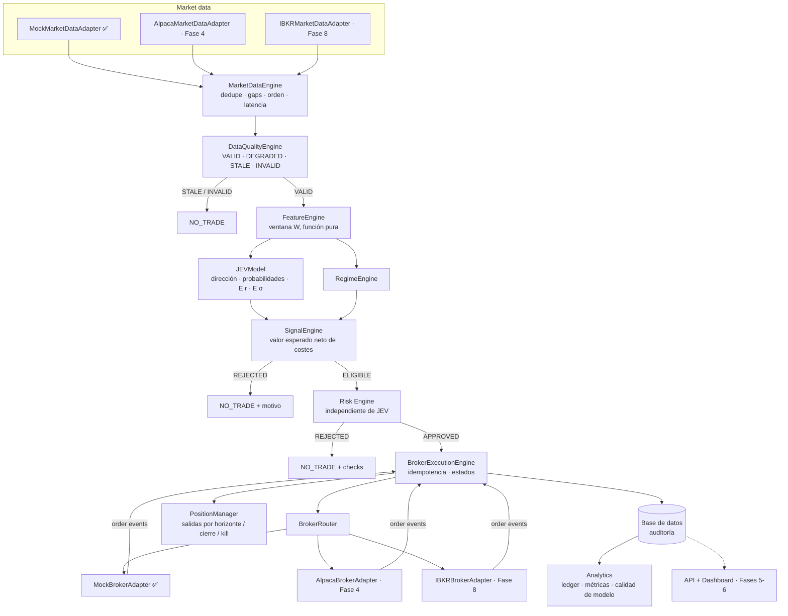
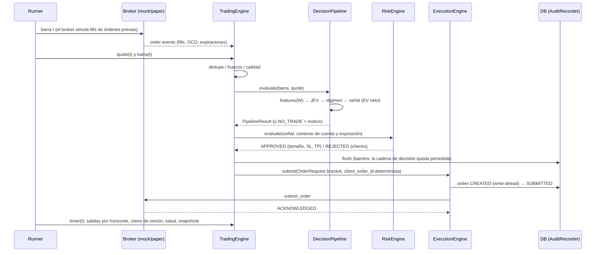

# JEV Real-Time Trading Engine — Arquitectura

> **Estado:** v0.1 — Fases 0, 1 y 2 completadas (mocks + pipeline local funcionando de punta a punta).
> En este documento ✅ marca el alcance de las Fases 1–2. El sistema solo operará en **BACKTEST** sobre datos
> sintéticos con un broker simulado. **Live trading no existe en este código** y está bloqueado por diseño.

---

## 0. Punto de partida (Fase 0 — inspección)

| Pregunta | Hallazgo |
|---|---|
| ¿Existe repositorio? | No. El directorio estaba vacío (sin git, sin código, sin datos). |
| ¿Existe JEV? | No. El usuario confirmó que no hay implementación previa del modelo. |
| ¿Datasets? | Ninguno. |
| ¿Código reutilizable? | Ninguno. Proyecto *greenfield*. |

Consecuencias de diseño (regla 12: *si falta información, no inventarla*):

1. **JEV se define como contrato**, no como algoritmo: la interfaz `JEVModel` y su salida `JEVPrediction`.
2. La implementación incluida, `jev-heuristic 0.1.0`, es un **sustituto transparente y determinista** que existe
   solo para ejercitar el pipeline. **No se le atribuye ninguna ventaja estadística.** El modelo real se
   diseña y valida en la Fase 3 (walk-forward, costes, baselines).
3. Mientras no haya datos reales se usan **datos sintéticos deterministas** (`MockMarketDataAdapter`).
   Cualquier PnL obtenido sobre datos sintéticos **no dice nada** sobre mercados reales.

---

## 1. Principios

1. **Separación estricta de capas**: `MARKET DATA → DATA QUALITY → FEATURES → JEV → SIGNAL → RISK → EXECUTION → BROKER → ANALYTICS`.
   Cada capa expone una interfaz y solo depende de las capas anteriores y de `packages/common`.
2. **JEV predice, Risk decide, Execution ejecuta, el broker confirma.** JEV nunca dimensiona posiciones,
   nunca fija límites de pérdida y nunca llama a un broker.
3. **`NO_TRADE` es un resultado válido y deseable.** Cada no-operación queda registrada con su motivo.
4. **Paridad entre modos**: backtest, replay, shadow y paper ejecutan **el mismo `TradingEngine`**.
   Solo cambian el *runner* (quién entrega los eventos), el reloj y los adaptadores.
5. **Determinismo y reproducibilidad**: las features son una función pura de las últimas `W` barras,
   los identificadores son deterministas, todo RNG tiene semilla y el tiempo se obtiene de un `Clock` inyectado.
6. **El broker es la fuente de verdad** de órdenes y posiciones. Al arrancar se reconcilia el estado local con el del broker.
7. **Auditabilidad total**: cualquier orden se puede reconstruir hasta la barra de mercado que la originó.
8. **Seguro por defecto**: paper, kill switch, límites de riesgo; el modo live está bloqueado en código.

---

## 2. Vista general



Vista ASCII equivalente (spec §73), con el estado actual:

```text
            MARKET DATA  (Mock ✅ · Alpaca F4 · IBKR F8)
                  │
            NORMALIZATION (adapters → entidades comunes)
                  │
            DATA QUALITY ──── STALE/INVALID ──► NO_TRADE
                  │
            FEATURE ENGINE
                  │
                 JEV  (contrato ✅ · sustituto heurístico ✅ · modelo real F3)
                  │
            SIGNAL ENGINE ─── edge insuficiente / régimen / spread ──► NO_TRADE
                  │
             RISK ENGINE ──── REJECT ──► NO_TRADE
                  │ APPROVE
            BROKER ROUTER ─── Mock ✅ │ Alpaca F4 │ IBKR F8
                  │
              EXECUTION ◄──── ORDER EVENTS
                  │
               DATABASE ──► Analytics ✅ · Dashboard F6 · Learning F3
```

---

## 3. Stack técnico

| Área | Elección | Motivo |
|---|---|---|
| Lenguaje | Python ≥ 3.11 (probado en 3.14) | Ecosistema cuant/ML, SDKs oficiales de Alpaca e IBKR en Python. |
| Concurrencia | `asyncio` | WebSockets de market data y órdenes sin hilos. |
| Entidades / config | pydantic v2 | Validación estricta en las fronteras (normalización, YAML). |
| Cálculo | numpy (features), pandas (analytics) | Estándar, vectorizado. |
| Persistencia | SQLAlchemy 2 async · SQLite (local) · PostgreSQL (Docker) | Mismo modelo en ambos motores. |
| Tests | pytest + pytest-asyncio | Unit, contract, integration, e2e. |
| Planificado | FastAPI (F5), React (F6), Redis (F5), Prometheus/Grafana/OpenTelemetry (F5), alpaca-py (F4), ib_async (F8), scikit-learn (F3) | Se añaden cuando la fase lo requiere. |

---

## 4. Estructura del repositorio

```text
JEV-Trading/
├── apps/
│   ├── trading_engine/     CLI + composición (bootstrap) ✅
│   ├── api/                FastAPI + WebSockets (Fase 5)
│   ├── model_service/      entrenamiento/serving de modelos (Fase 3)
│   └── dashboard/          React (Fase 6)
├── packages/
│   ├── common/             entidades, enums, config, reloj, ids, logs, calendario, costes, bus, seguridad
│   ├── market_data/        MarketDataAdapter, Mock + generador sintético, MarketDataEngine, agregador
│   ├── data_quality/       DataQualityEngine
│   ├── features/           indicadores (funciones puras), FeatureSpec, FeatureEngine
│   ├── jev/                JEVModel, sustituto heurístico, baselines, registro
│   ├── signals/            RegimeEngine, SignalEngine (valor esperado)
│   ├── risk/               RiskEngine, sizing, kill switch, portfolio
│   ├── execution/          ExecutionEngine, máquina de estados, PositionManager, reconciliación
│   ├── brokers/
│   │   ├── base/           BrokerAdapter (contrato)
│   │   ├── mock/           MockBrokerAdapter (exchange simulado) ✅
│   │   ├── alpaca/         diseño documentado (Fase 4)
│   │   ├── ibkr/           diseño documentado (Fase 8)
│   │   └── router.py       BrokerRouter
│   ├── pipeline/           DecisionPipeline, TradingEngine, SimulationRunner, salud, replay
│   ├── persistence/        modelos SQL, repositorios, AuditRecorder
│   ├── analytics/          ledger de trades, métricas, calidad de predicción
│   └── backtesting/        walk-forward, datasets históricos (Fase 3)
├── config/                 default.yaml (+ perfiles)
├── models/                 artefactos de modelos (no versionados)
├── tests/{unit,contract,integration,backtesting,e2e}
├── infra/                  Dockerfiles
├── docs/  scripts/
├── .env.example  docker-compose.yml  pyproject.toml  README.md
```

**Desviaciones justificadas respecto al esquema del spec (§58):**

- `packages/pipeline/`: la orquestación (`TradingEngine`) vive en un paquete y no en `apps/trading_engine`
  porque **la usan todos los modos** (backtest, replay, shadow, paper). Si estuviera dentro de la app, el
  backtester tendría que reimplementarla, violando la regla §32.
- `packages/persistence/`: el spec exige base de datos pero no le asigna paquete.
- `config/`: los YAML de configuración viven fuera del código.

---

## 5. Componentes

| Componente | Paquete | Responsabilidad | NO hace |
|---|---|---|---|
| `MarketDataAdapter` | `market_data.base` | Conectar, suscribir, entregar eventos **ya normalizados**, históricos. | Decidir nada. |
| `MarketDataEngine` | `market_data.engine` | Dedupe, detección de huecos y desorden, latencias, buffer, último quote. | Calcular features. |
| `DataQualityEngine` | `data_quality` | Clasificar cada barra en `VALID/DEGRADED/STALE/INVALID` con motivos. | Corregir datos. |
| `FeatureEngine` | `features` | Features reproducibles como función pura de las últimas `W` barras. | Mirar barras futuras. |
| `JEVModel` | `jev` | Dirección, probabilidades, retorno y volatilidad esperados, confianza. | Sizing, stops, límites, órdenes. |
| `RegimeEngine` | `signals.regime` | `TRENDING_UP/DOWN, RANGE, HIGH/LOW_VOLATILITY, UNKNOWN`. | Suponer que un régimen es rentable. |
| `SignalEngine` | `signals.engine` | Valor esperado neto de costes, filtros estadísticos, estado de la señal. | Mirar la cuenta o el riesgo. |
| `RiskEngine` | `risk` | Autoridad final: aprueba/rechaza, tamaño, stop, take profit, pérdida máxima. | Cambiar la predicción de JEV. |
| `KillSwitch` | `risk.kill_switch` | Bloqueo inmediato de nuevas entradas; persistente; reset solo manual. | Rearmarse solo. |
| `ExecutionEngine` | `execution` | Enviar/cancelar/reemplazar con idempotencia; aplicar eventos del broker. | Conocer internos de JEV. |
| `PositionManager` | `execution.position_manager` | Salida por horizonte, cierre de sesión, kill switch, entradas parciales. | Abrir posiciones nuevas. |
| `Reconciler` | `execution.reconciliation` | Reconstruir órdenes, posiciones, exposición y PnL diario al arrancar. | Ocultar discrepancias (activa kill switch). |
| `BrokerRouter` | `brokers.router` | Elegir la infraestructura de ejecución. | Modificar la orden o la señal. |
| `BrokerAdapter` | `brokers.*` | Traducir órdenes/eventos entre el formato común y el nativo. | Lógica de trading. |
| `TradingEngine` | `pipeline.engine` | Orquestar el flujo por barra, eventos de órdenes y temporizadores. | Depender del modo. |
| `AuditRecorder` | `persistence.recorder` | Persistir todo evento auditable (por lotes, con barrera antes de cada orden). | Bloquear el bucle innecesariamente. |
| Analytics | `analytics` | Trades ida-vuelta, MAE/MFE, métricas, calidad del modelo vs ejecución. | Retroalimentar decisiones en vivo. |

Interfaces principales (firmas completas en `docs/BROKER_ARCHITECTURE.md` y en el código):

```python
class MarketDataAdapter(ABC):   # packages/market_data/base.py
    async def connect(self); async def disconnect(self)
    async def subscribe_quotes(self, symbols); async def subscribe_trades(self, symbols)
    async def subscribe_bars(self, symbols, timeframe)
    async def get_historical_bars(self, symbol, start, end, timeframe) -> list[MarketBar]
    def stream(self) -> AsyncIterator[MarketEvent]
    async def health(self) -> MarketDataHealth

class JEVModel(ABC):            # packages/jev/base.py
    metadata: ModelMetadata
    required_features: tuple[str, ...]
    def predict(self, features: FeatureVector) -> JEVPrediction

class RiskEngine(ABC):          # packages/risk/engine.py
    def evaluate(self, signal: Signal, context: RiskContext) -> RiskDecision

class ExecutionEngine(ABC):     # packages/execution/base.py
    async def submit(self, order: OrderRequest) -> Order
    async def cancel(self, client_order_id: str) -> None
    async def replace(self, client_order_id: str, changes: OrderReplace) -> Order

class BrokerAdapter(ABC):       # packages/brokers/base/adapter.py
    # connect, disconnect, get_account, get_positions, get_orders, submit_order,
    # cancel_order, replace_order, get_order, stream_order_events (+ health, get_instrument)
```

---

## 6. Entidades normalizadas (`packages/common/entities.py`)

| Entidad | Contenido clave |
|---|---|
| `MarketBar` | `symbol, timeframe, start (UTC), open, high, low, close, volume, vwap, source, received_at`; `end = start + timeframe`. |
| `MarketQuote` / `MarketTrade` / `MarketTick` | Top of book, último trade, y la instantánea combinada del ejemplo del spec (§10). |
| `DataQualityReport` | `status` + lista de `DataIssue(code, status, detail)`. |
| `FeatureVector` | `feature_id, timestamp (as-of), feature_version, spec_hash, values, window_start/end, quote usado`. |
| `JEVPrediction` | `direction, probability_up/down, expected_return, expected_volatility, confidence, model_version, feature_version`. |
| `RegimeAssessment` | `regime, adx, trend_strength, volatility_ratio, reason`. |
| `Signal` | Spec §20 + `expected_value` (bruto, costes, neto), `reference_price`, `status`, `rejection_reasons`, `expires_at`. |
| `RiskDecision` | `verdict, reasons, checks[]` + `quantity, stop_loss, take_profit, stop_distance, max_loss, risk_reward`. |
| `OrderRequest` / `Order` / `OrderEvent` / `Fill` | Orden solicitada, vista normalizada del broker, evento con instantánea de la orden, ejecución. |
| `Position` / `AccountSnapshot` / `PortfolioSnapshot` | Estado del broker y del portafolio. |
| `Trade` | Ida y vuelta con precios reales **y** de referencia, costes, slippage, MAE/MFE (separa modelo de ejecución). |

Todos los timestamps son `datetime` con zona **UTC**; un timestamp *naive* es un error de validación.

---

## 7. Flujo por barra



---

## 8. Temporalidad y prevención de *look-ahead*

- La decisión sobre la barra `t` se toma en su cierre (`bar.end`); el `FeatureVector` usa solo barras con `end ≤ t`
  y el último quote recibido **antes** de la decisión.
- Una orden enviada en `t` se ejecuta, como pronto, en la **apertura de la barra siguiente** (simulación).
- Stops/take profit dentro de una barra: suposición **conservadora** — si ambos niveles caben en el rango de la
  barra, se asume que se tocó primero el stop; en la barra de entrada solo puede saltar el stop.
- La evaluación de la calidad del modelo (`PredictionOutcomeTracker`) compara cada predicción con el precio
  `horizon` minutos después **solo cuando ese tiempo ya pasó**, y nunca retroalimenta decisiones.
- Tests que lo verifican: `tests/unit/test_features.py` (sin look-ahead, invariancia de ventana, determinismo).

---

## 9. Modos de operación

| Modo | Datos | Reloj | Broker | Runner | Estado |
|---|---|---|---|---|---|
| `backtest` | sintéticos / históricos | simulado | `MockBrokerAdapter` (exchange simulado) | `SimulationRunner` | ✅ sintético · históricos en F3 |
| `replay` | históricos | simulado con *pacing* | Mock | `SimulationRunner(pace>0)` | F3 |
| `shadow` | tiempo real | sistema | Mock alimentado con datos reales (sin órdenes reales) | `RealtimeRunner` | F7 |
| `paper` | tiempo real | sistema | Alpaca Paper / IBKR Paper | `RealtimeRunner` | F4 / F8 |
| `live` | — | — | — | — | **Bloqueado en código** |

El modo se imprime siempre en el banner de la CLI y se guarda en cada registro (`engine_runs`, `orders`, `trades`…).
Para `live` se exige `LIVE_TRADING_ENABLED=true` **y además** el código actual se niega a arrancar
(`packages/common/safety.py`). En modos no-live, si un broker reporta una cuenta real, el motor se niega a operar.

---

## 10. Bus de eventos interno (`packages/common/events.py`)

`EventBus` asíncrono en proceso: los manejadores se ejecutan en orden y de forma determinista. En la Fase 5 se
añade un puente a Redis para la API/dashboard. Tópicos:

`market.bar`, `features`, `prediction`, `prediction.outcome`, `signal`, `risk.decision`, `order.update`,
`order.event`, `fill`, `trade`, `portfolio.snapshot`, `risk.event`, `system.event`, `broker.event`.

Los errores de un suscriptor no detienen el motor, pero se reportan a salud; `bus.flush()` sí propaga errores
porque es la barrera de auditoría previa a cada orden.

---

## 11. Persistencia y cadena de auditoría

Tablas (spec §40 + `engine_runs` y `system_state`):

`market_bars, market_ticks, features, model_predictions, signals, risk_decisions, orders, order_events,
positions, trades, portfolio_snapshots, risk_events, system_events, model_versions, backtest_runs,
backtest_trades, broker_accounts, broker_events, engine_runs, system_state`.

Cadena de auditoría (spec §41) y claves que la enlazan:

```text
market_bars ──(symbol, window_start..window_end)──► features.feature_id
features.feature_id ──► model_predictions.feature_id
model_predictions.prediction_id ──► signals.prediction_id
signals.signal_id ──► risk_decisions.signal_id
signals.signal_id ──► orders.signal_id  (entrada + piernas TP/SL + salidas)
orders.client_order_id ──► order_events.client_order_id  (acks, fills, cancelaciones)
signals.signal_id ──► trades / backtest_trades  (PnL, slippage, MAE/MFE)
```

- Las órdenes se escriben **antes** de enviarse (*write-ahead*, `SqlOrderStore`) — base de la idempotencia.
- El resto de eventos se escribe por lotes; antes de enviar cualquier orden se fuerza `flush()`.
- SQLite para desarrollo (`data/jev.db`); PostgreSQL vía `DATABASE_URL` (Docker). Migraciones Alembic en la Fase 5.

---

## 12. Configuración

Precedencia: `config/default.yaml` < perfil (`--config`) < variables `JEV__SECCION__CLAVE` < opciones de la CLI.
Ejemplo: `JEV__RISK__MAX_DAILY_LOSS=0.01`. El esquema es estricto (`extra="forbid"`): una clave mal escrita
es un error, no un valor ignorado. Cada ejecución guarda el hash de su configuración (`engine_runs.config_hash`).

Los **secretos nunca** están en YAML, base de datos, logs ni frontend: solo en variables de entorno / `.env`
(no versionado) o un gestor de secretos. Ver `.env.example`.

---

## 13. Seguridad

- API keys solo por entorno; filtro de logs que enmascara valores de variables sensibles (`packages/common/logging.py`).
- Live bloqueado (doble puerta: variable + código). Paper verificado con `capabilities.is_paper`.
- Nada de automatización de navegador para ejecutar órdenes; TradingView es externo y opcional (ver `BROKER_ARCHITECTURE.md` §10).
- Endpoints de control (pausa, kill switch) requerirán autenticación fuerte (Fase 5).

---

## 14. Observabilidad

- Logs JSON estructurados (`configure_logging`).
- Latencias por etapa (`features`, `model`, `signal`, `risk`, `submit`) medidas en cada decisión y guardadas en
  `model_predictions.latency_ms` / eventos. Latencias de mercado: `received_at − exchange timestamp`.
- Fase 5: endpoint Prometheus, dashboards Grafana, trazas OpenTelemetry (market→feature, feature→model,
  inferencia, riesgo, envío, ack del broker, fill).

---

## 15. Salud y kill switch

`HealthMonitor` evalúa: `market_data_connected, broker_connected, account_available, order_stream_connected,
database_available, redis_available, clock_synchronized`. Cualquier fallo crítico bloquea nuevas entradas
(check `system_health` del Risk Engine) y, pasado un umbral, activa el kill switch. Detalle en `docs/RISK.md`.

---

## 16. Decision Replay

`python -m apps.trading_engine trace <signal_id>` reconstruye: barras de la ventana, features, predicción,
régimen, señal, decisión de riesgo, órdenes (entrada, piernas, salidas), eventos y trade.
`python -m apps.trading_engine verify <signal_id>` **recalcula** features y predicción a partir de las barras
guardadas con la misma versión del modelo y comprueba que coinciden (reproducibilidad).

---

## 17. Limitaciones conocidas (v0.1)

- JEV es un sustituto heurístico sin ventaja demostrada; los datos son sintéticos.
- El calendario de mercado es de horario regular sin festivos (el calendario oficial llega con Alpaca, Fase 4).
- El mock no simula fills parciales en órdenes bracket (sí en órdenes simples, opcional).
- No hay aún runner en tiempo real, API, dashboard, Redis ni métricas Prometheus expuestas (Fases 4–6).
- Una sola posición gestionada por símbolo (sin piramidar ni revertir con posición abierta).
