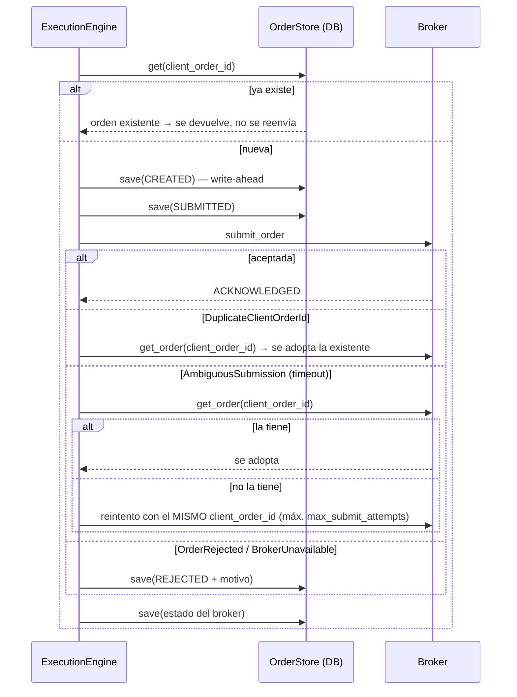
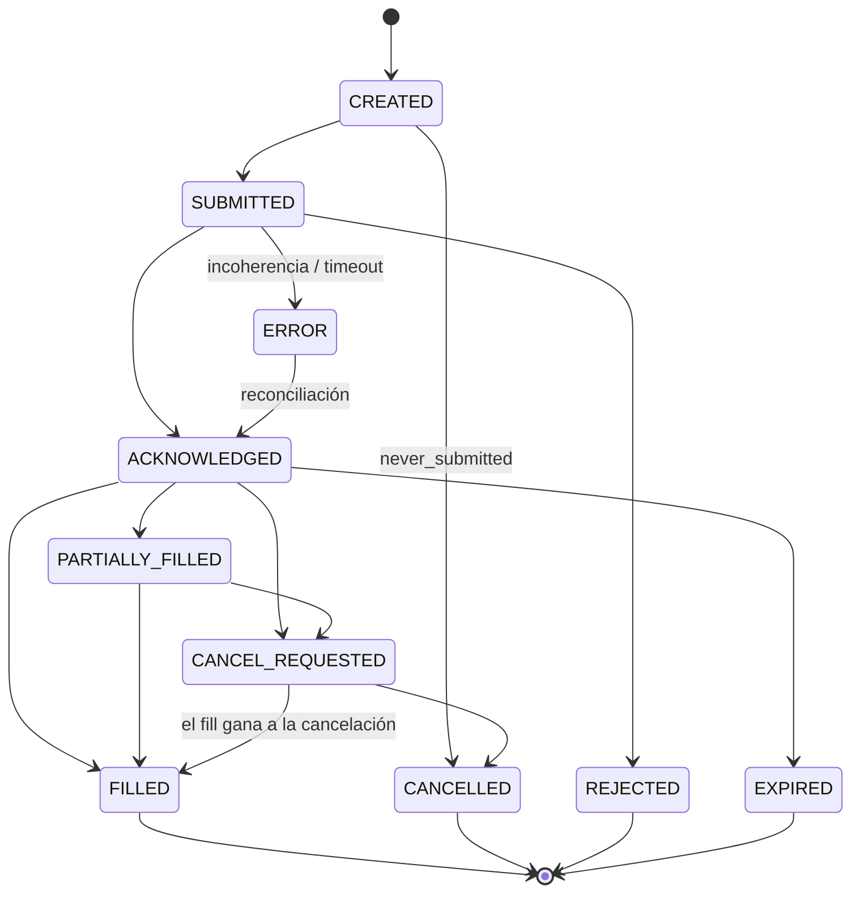

# Execution Engine, idempotencia y recuperación

## 1. Responsabilidades

`BrokerExecutionEngine` (`packages/execution/engine.py`) implementa la interfaz `ExecutionEngine`
(`submit`, `cancel`, `replace`) y además:

- aplica los eventos del broker a la **máquina de estados** de cada orden y deriva los *fills*;
- garantiza **idempotencia** (nunca dos órdenes para la misma intención);
- persiste cada orden **antes** de enviarla (*write-ahead*).

No conoce JEV: recibe `OrderRequest` ya dimensionadas por el Risk Engine. El `PositionManager` decide las
salidas; el `Reconciler` reconstruye el estado tras un reinicio.

## 2. Órdenes en v1

| Uso | Tipo | Detalle |
|---|---|---|
| Entrada | `market`, TIF `day`, clase `bracket` | TP = `limit`, SL = `stop`, OCO en el broker: la protección vive en el broker aunque el motor caiga. |
| Salida por horizonte | `market` | Al vencer `horizon_minutes` desde el fill de entrada: cancelar piernas → cerrar lo que quede. |
| Cierre de sesión | `market` | `flatten_minutes_before_close` (5) antes del cierre. |
| Kill switch | `market` | Solo si `flatten_on_kill: true`. |
| Entrada parcial | `market` | Si una entrada termina parcialmente ejecutada, se cierra el remanente (`risk_exit`). |

## 3. `client_order_id` determinista

```text
signal_id       = S-{SIMBOLO}-{YYYYMMDDHHMM}-{hash(namespace, estrategia, símbolo, timestamp)[:8]}
client_order_id = jev-{signal_id}-{código}{intento>1}
códigos: en (entrada) · tp · sl · tx (horizonte) · ex (cierre de sesión) · kx (kill) · rx (riesgo)
ejemplo: jev-S-MOCKA-202609141032-7QH2M9KD-en
```

- `namespace` = `run_id` en backtest (reproducible por ejecución) y `estrategia:modo:broker` en paper/shadow
  (**estable entre reinicios**). Reprocesar la misma barra tras un reinicio produce el mismo `signal_id` y, por
  tanto, el mismo `client_order_id`.
- En el mock, las piernas se llaman `{padre}-tp` / `{padre}-sl`; en brokers reales pueden tener ids asignados por el
  broker y se enlazan por `parent_client_order_id`.

## 4. Protocolo de envío idempotente



Ventanas de caída y resultado (probadas en `tests/integration/test_idempotency_recovery.py`):

| Caída… | Estado en DB | Al reiniciar |
|---|---|---|
| antes de persistir | nada | la barra se reprocesa → mismo id → se envía una vez |
| tras `CREATED`, antes de enviar | `CREATED` | el broker no la conoce → `CANCELLED (never_submitted)`; **no se reenvía** automáticamente una intención vieja |
| tras enviar, antes del ack | `SUBMITTED` | el broker la conoce → se adopta su estado (y sus fills) |
| tras el fill | `SUBMITTED`/`ACKNOWLEDGED` | se adoptan fills del broker; posiciones y PnL se reconstruyen |
| petición duplicada | cualquiera | `submit` devuelve la orden existente |

## 5. Máquina de estados



Reglas (`packages/execution/state_machine.py`):

- Terminales: `FILLED, CANCELLED, REJECTED, EXPIRED`. Un evento posterior a un estado terminal se ignora y se
  registra como anomalía. `ERROR` **no** es terminal: significa "estado desconocido, reconciliar".
- Un broker rápido puede saltarse estados (p. ej. `SUBMITTED → FILLED`): está permitido.
- Los *fills* se derivan de la **cantidad acumulada** del broker: `delta = acumulada_evento − acumulada_local`.
  Eventos duplicados (mismo `event_id`) o con acumulada menor (desordenados) no generan fills.
- `fill_id = {client_order_id}:{acumulada}` → idempotente también para fills sintetizados por reconciliación.
- **Nunca** se considera ejecutada una orden solo porque se envió: los fills vienen exclusivamente de eventos
  del broker o de su estado consultado.

## 6. Ciclo de vida de la posición (`PositionManager`)

```text
PENDING_ENTRY ──fill entrada──► OPEN ──horizonte / cierre de sesión / kill──► EXITING ──qty = 0──► CLOSED
      │                           └──TP o SL (OCO en el broker)──────────────────────────────► CLOSED
      └──señal caducada sin fill: cancelar entrada──► CLOSED (señal EXPIRED)
```

Salida gestionada: (1) cancelar piernas abiertas, (2) esperar su confirmación, (3) si queda cantidad, enviar
`market` de cierre con id determinista (`…-tx`, `…-ex`, `…-kx`, `…-rx`). Si una pierna se ejecuta mientras tanto,
la cantidad pendiente se recalcula y no se envía una orden de más.

## 7. Reconciliación al arrancar (`packages/execution/reconciliation.py`)

1. Para cada orden no terminal en la DB: consultar al broker por `client_order_id` y adoptar su estado y fills.
   Si el broker no la conoce: `CREATED → CANCELLED (never_submitted)`; cualquier otro estado → `ERROR
   (missing_at_broker)` + kill switch.
2. Órdenes abiertas en el broker que la DB no conoce: si son piernas de una orden propia, se adoptan; si no →
   `UNEXPECTED_ORDER` → kill switch.
3. Reconstruir ciclos de vida de posiciones desde las órdenes guardadas; comparar la posición esperada por
   símbolo con la del broker → diferencia = `UNEXPECTED_POSITION` → kill switch.
4. Cargar posiciones del broker en el `PortfolioTracker` (exposición) y la cuenta (`equity − last_equity` = PnL diario).

## 8. Matriz de recuperación ante fallos (spec §53)

"test ✅" = cubierto por tests automáticos (`tests/integration/test_recovery.py` salvo indicación).

| Escenario | Comportamiento | Cobertura |
|---|---|---|
| Petición de orden duplicada | se devuelve la orden existente | test ✅ |
| Timeout de envío (antes/después de aceptar) | consulta + adopción o reintento con el mismo id | test ✅ |
| Reinicio del worker | reconciliación de órdenes, posiciones, exposición y PnL diario | test ✅ |
| Fill parcial | fills por acumulada; entrada parcial terminada → cierre del remanente | test ✅ fills por acumulada (`tests/unit/test_state_machine_and_ids.py`); el cierre del remanente aún no se ejercita (las entradas bracket del mock se llenan completas) |
| Broker desconectado | health `broker_connected` falla → sin entradas → kill switch tras 60 s | test ✅ |
| Posición / orden inesperada | kill switch | test ✅ |
| Caída de la base de datos | la barrera de auditoría falla → sin orden + kill switch | test ✅ |
| Desconexión de WebSocket | reconexión + backfill + reconciliación | Fase 4 (Alpaca) |
| Reinicio de API / Redis / PostgreSQL | reconexión; sin DB no se opera | Fase 5 |
| Fallo de red | `AmbiguousSubmission` / `BrokerUnavailable` según el punto de fallo | Fase 4 |
| Timeout de orden sin ack | reconsulta tras `ack_timeout_seconds`; si sigue sin conocerse → `ERROR` | test ✅ |

## 9. Modelo de fills y costes

El `MockBrokerAdapter` aplica las reglas de `BROKER_ARCHITECTURE.md` §5 y el `CostModel`
(`packages/common/costs.py`), el mismo que usa el Signal Engine para el valor esperado:

| Coste | Parámetro (`costs`) | Nota |
|---|---|---|
| Spread | quote real o `default_spread_bps` | medio spread por lado |
| Slippage | `slippage_bps` por lado | adverso |
| Comisión | `commission_per_share`, `commission_bps`, `min_commission` | 0 por defecto: **verificar tarifas del broker** |
| Tasas regulatorias en ventas | `sec_fee_rate`, `taf_per_share`, `taf_max_per_trade` | 0 por defecto: **fijar con las tarifas vigentes** |
| Latencia | `latency_ms`, `latency_cost_factor` | coste ≈ volatilidad × √latencia |

Los informes siempre separan PnL bruto, comisiones/tasas, slippage y PnL neto.

## 10. Calidad del modelo vs calidad de la ejecución

Para cada trade se guardan precio **de referencia** y precio **real** de entrada y salida:

- Entrada: referencia = cierre de la barra de decisión (`signal.reference_price`).
- Salida: referencia = nivel de TP/SL, o el cierre de la barra en la que se decidió la salida (horizonte, sesión, kill).
- `model_pnl` = PnL a precios de referencia (lo que el plan de JEV habría ganado con ejecución perfecta).
- `execution_shortfall = model_pnl − net_pnl` (slippage + spread + comisiones).
- Además, `PredictionOutcomeTracker` mide el acierto direccional de **todas** las predicciones a su horizonte,
  operadas o no, sin depender de ninguna ejecución.

Así se puede responder: *¿JEV se equivocó?* (acierto direccional / `model_pnl` negativos) frente a
*¿JEV acertó pero la ejecución fue mala?* (`model_pnl` positivo con `execution_shortfall` alto).
